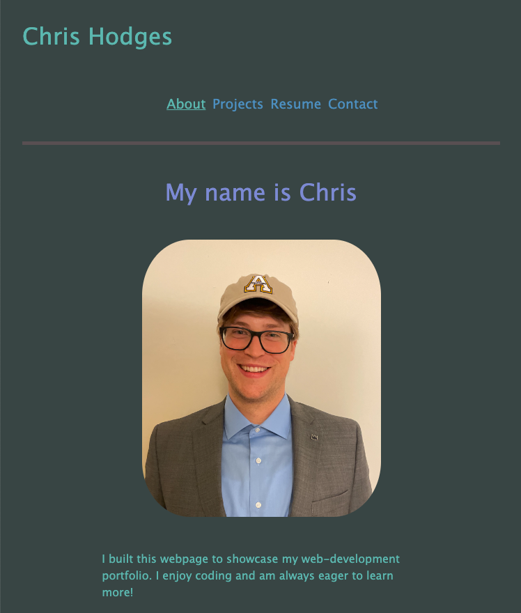
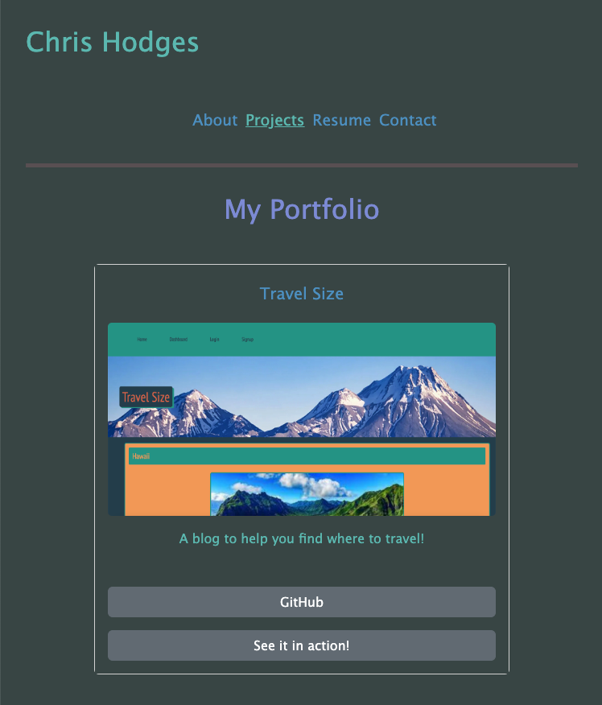

# React Portfolio

## Description
A professional portfolio showcasing projects developed by Chris Hodges. Single page application made with React and bootstrap.

## Deployed Application
The app is deployed at https://chrisdhodges12.github.io/react-portfolio/

## Installation
To access the application locally:

Install dependencies by running `npm i` in the command line.

Use `npm start` to view the page at localhost:3000 in the browser.

Run `npm run deploy` to deploy to GitHub Pages.

## Screenshot

 

 

## Contributions
Developed by Chris Hodges

## Questions
For any questions, contact me at chrisdhodges12@gmail.com or find me on GitHub at https://github.com/chrisdhodges12

